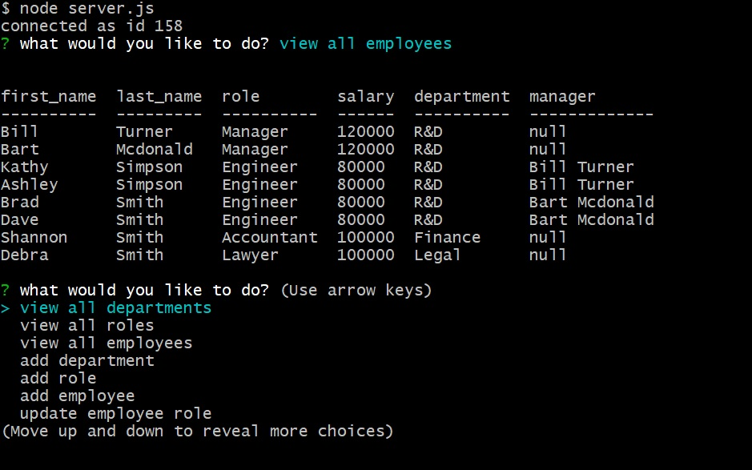

# Employee Tracker

## Description

This app creates a CLI based interface to manage a company's employees. It allows users to add, remove and update departments, roles and employees. It also allows users to view all the company's employees (including by the use of filters such as the employees' manager), departments and roles.

It uses Node.js for the server. The underlying database is a MySQL DB. The npm inquirer package is used for the CLI, and the npm mysql package is used to interact with MySQL DB. The MySQL API interface is abstracted through the EmployeeTrackerSql class such that the server doesn't have to deal with the nitty-gritty details of the SQL queries. The npm console.table package is used to tabulate the SQL tables.

Here is a snapshot of the app: 

## Instructions

Install the required dependencies via "npm install" and then run the app via Node.js.

## Usage

The app provides a simple CLI interface that the user can use to perform various operations.

## Tests

This app was tested manually.

## Future

More CLI features such as various filtering commands will be added in the future (e.g. view employees by their role).